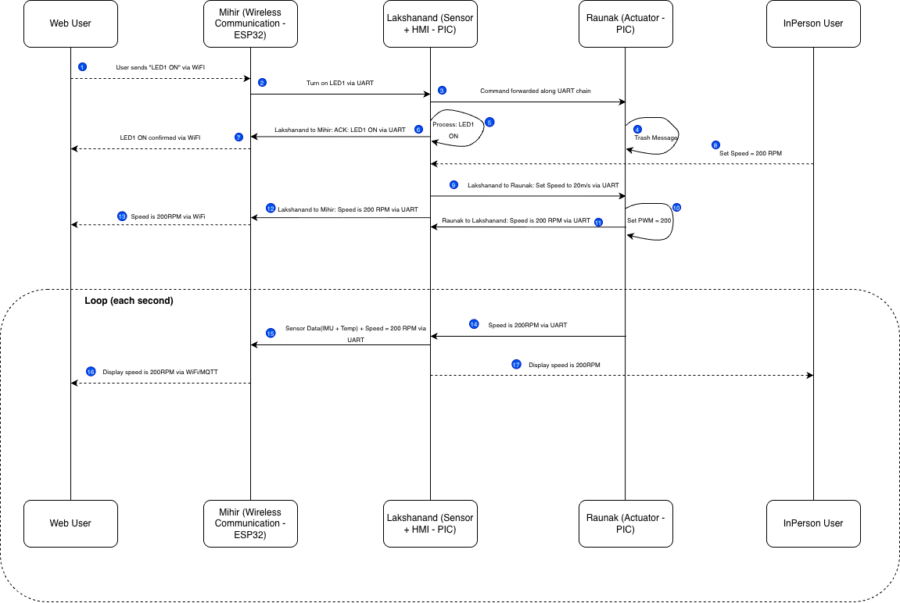

# Process Diagram

# Communication Sequence Functionality & Requirements Alignment

Our sequence diagram captures the end-to-end flow of data and control between
the Web User, ESP32 Wireless Gateway (Mihir), Sensor + HMI subsystem
(Lakshanand), and Actuator Control subsystem (Raunak). Below we break down
each major functional step and explain how it satisfies user needs and system
requirements.

## 1. User-Initiated Drive Command

The web user inputs a drive command such as set speed to 200 RPM using the web
dashboard. The MQTT broker delivers it to the ESP32 which frames a 64-byte UART
packet addressed to the Actuator board and sends it downstream. The Sensor board
sees the destination is not its own ID and forwards the frame unchanged. The
Actuator board processes the command and updates its PWM outputs to set motor
speed.

This flow enables safe remote operation from a distance and demonstrates correct
daisy-chain propagation where no direct ESP32 to Actuator communication happens.
The structured UART frames allow deterministic routing and easy debugging.

## 2. Telemetry Reporting & Hazard Calculation

The Actuator PIC sends motor telemetry including current speed and state upstream
to the Sensor board. The Sensor board reads its own IMU and temperature data,
computes a hazard score, and forwards the combined data upstream to the ESP32.
The ESP32 publishes the telemetry and hazard score to the MQTT broker and the
web dashboard updates in real time.

This ensures live situational awareness for the remote operator and converts raw
sensor readings into a simplified hazard score. Both commands and telemetry use
the same structured pathway in opposite directions.

## 3. Local HMI Display Update

On each telemetry cycle the Sensor + HMI PIC reads its local sensor data and
receives motor telemetry from the Actuator board. It computes an updated hazard
score and pushes the result to the OLED display via I2C. Anyone physically near
the device can view live speed, hazard score, and system status without needing
the web dashboard.

This provides immediate local feedback and educational transparency so showcase
visitors can trace the sensor to computation to display pipeline directly.

## 4. Recurring Telemetry Loop

Every second the Sensor + HMI PIC sends periodic sensor data including IMU
readings, temperature, and hazard score upstream to the ESP32 via UART. The
ESP32 publishes the update to the MQTT broker. This ensures the system stays
under the sub-second update target and enables stable remote supervision during
demos.

## 5. Emergency Stop & Safety Handling

When the in-person user presses the Emergency Stop button on the HMI, the
Sensor + HMI PIC sends an EMERGENCY_STOP frame downstream. The Actuator PIC
immediately disables motor outputs and sends an ACK_STOP frame upstream. The
ESP32 publishes the emergency status to the MQTT broker and the web user receives
a fault notification.

This provides immediate motor shutdown to prevent unsafe behavior. Faults travel
both upstream and downstream so the entire system is aware of the fault condition,
meeting safety requirements for public demonstrations.

## 6. Wireless Link Loss & Safe-Stop Fallback

When the ESP32 detects MQTT connection loss it sends a SAFE_STOP frame downstream
via UART. The Sensor + HMI PIC forwards the frame to the Actuator PIC which
disables motor outputs. The OLED displays a connection lost status so anyone
near the device knows the wireless link is down.

Motors halt without any user action required. This directly satisfies the
connection loss handling requirement and ensures the robot does not continue
operating uncontrolled if the wireless link drops.

# Summary of Functional Alignment

**Latency and Predictability** - Structured UART forwarding ensures consistent
propagation time between boards.

**Bi-Directional Control** - Both web-based commands and in-person HMI inputs
are supported simultaneously.

**Modularity and Scalability** - Each board forwards or consumes frames based
on destination ID, allowing future expansion without changing the protocol.

**Educational Clarity** - The sequence explicitly shows every hop in the daisy
chain, reinforcing modular architecture understanding for showcase visitors.

**Reliability and Safety** - Emergency stop, wireless link loss detection,
acknowledgment frames, and telemetry monitoring ensure stable system behavior
under both user-triggered and automatic fault conditions.