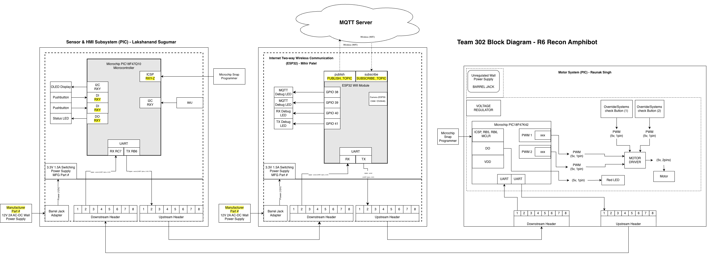

# Block Diagram

---

# Overall Team Subsystem Layout:

The R6 Recon Amphibot system consists of three modular subsystems connected using a standardized UART daisy-chain architecture:

1. **Mihir Patel – Wireless Communication (ESP32 Gateway)**
2. **Lakshanand Sugumar – Sensor + HMI (PIC)**
3. **Raunak Singh – Actuator Control (PIC Motor Driver)**

The linear data flow through the system is:

ESP32 Wireless Gateway → Sensor + HMI PIC → Actuator PIC  

Messages propagate from one microcontroller to the next using structured UART frames until the destination address matches the receiving board.

Look under Individual Block Diagrams for detailed subsystem-specific schematics.

---

# Block Diagram Decision-Making & Requirements Alignment

## 1. Decision-Making Process

### 1. Role-Based Functional Partitioning

**Why:**  
Each team member owns a distinct subsystem aligned with project requirements:

- Wireless Communication (Wi-Fi + MQTT)
- Sensor + HMI (IMU, OLED, Hazard Score)
- Actuator Control (Motor Driver, PWM, Safety)

**How:**  
We divided the system into three primary PCB blocks, each containing:
- A microcontroller
- A 3.3V switching regulator
- Upstream and downstream UART headers
- Clearly defined TX and RX lines

The diagram shows a left-to-right linear data flow representing the physical UART daisy-chain connection.

---

### 2. Daisy-Chain UART Bus

**Why:**  
Minimizes wiring complexity and PCB pin usage while supporting modular expansion.

**How:**  
Each board includes:
- One upstream 2×4 IDC header
- One downstream 2×4 IDC header

Messages hop from one MCU to the next using structured UART packets with defined source and destination IDs.

TX and RX connections are explicitly shown entering and exiting each microcontroller block.

---

### 3. Local I²C & Peripheral Buses

**Why:**  
Certain peripherals require dedicated serial communication protocols.

**How:**  

Inside each subsystem:

- Sensor + HMI Board:
  - I²C used for IMU
  - I²C used for OLED display
- Actuator Board:
  - PWM outputs to motor driver
- ESP32 Board:
  - Internal camera interface for FPV module

These local buses are clearly separated from the UART daisy-chain network in the diagram.

This highlights protocol separation:
- UART → inter-board communication
- I²C/PWM → local peripheral communication

---

### 4. Integrated Wi-Fi / MQTT Link

**Why:**  
Wireless communication is required for remote control and telemetry feedback.

**How:**  
The ESP32 Wireless Gateway connects via Wi-Fi to an external MQTT server (represented by a cloud icon in the diagram).

The ESP32:
- Subscribes to control topics
- Publishes telemetry and hazard data
- Converts MQTT messages into UART frames for downstream boards

---

### 5. Dedicated 3.3 V Regulators on Every Board

**Why:**  
Ensures stable power and isolates electrical noise between subsystems.

**How:**  
Each subsystem includes:

- Barrel Jack
- 3.3V Switching Regulator
- Microcontroller powered from regulated rail

This prevents high-current motor activity from brown-out conditions on sensor or wireless boards.

---

# 2. How the Block Diagram Meets Product Requirements

### Real-Time Feedback (< 500 ms)

The UART daisy-chain uses deterministic packet forwarding, ensuring predictable latency.

Local I²C and PWM communication operate at microcontroller clock speeds, enabling near real-time actuation and hazard reporting.

---

### Modularity & Scalability

Each subsystem is clearly separated and connected only through standardized 8-pin UART headers.

Future boards may be inserted into the daisy chain without redesigning existing PCBs.

---

### Educational Clarity

The left-to-right flow of the diagram mirrors:

Power → Wireless → Sensors → Actuation

This makes it easy to visually trace how user commands travel from the web interface to motor movement.

---

### Robust Power Architecture

Each PCB includes an independent switching regulator.

Motor current spikes are electrically isolated from:

- ESP32 Wi-Fi circuitry
- Sensor measurement circuits
- OLED display logic

---

### Cloud & Local Interfaces

The system supports dual user interfaces:

- Web-based MQTT control via ESP32
- Local OLED + pushbutton HMI

This satisfies both remote monitoring and in-person demonstration requirements.

---

### Error Isolation & Safety

UART packet structure supports error reporting between boards.

Each board can detect and forward error conditions upstream.

If wireless communication is lost:

- ESP32 detects disconnect
- Safe-stop message is issued
- Actuator board halts motor operation

---

# How the Decision-Making Process Operated

Our block diagram is a simplified representation of the full system.

It demonstrates that:

- Each subsystem includes the required voltage regulator.
- Each subsystem includes a microcontroller.
- Each subsystem includes upstream and downstream UART connections.
- TX and RX lines are clearly shown entering and exiting each MCU.

The diagram illustrates how information flows through the team:

Web Interface → ESP32 Wireless Gateway → Sensor + HMI PIC → Actuator PIC  

This mirrors both the physical ribbon cable layout and the logical message propagation through the UART daisy-chain.