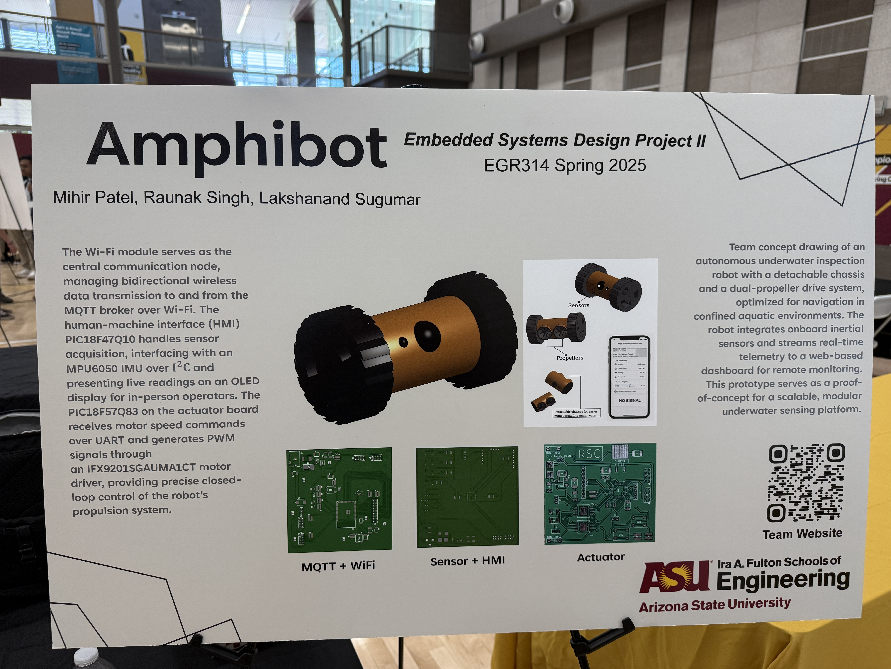
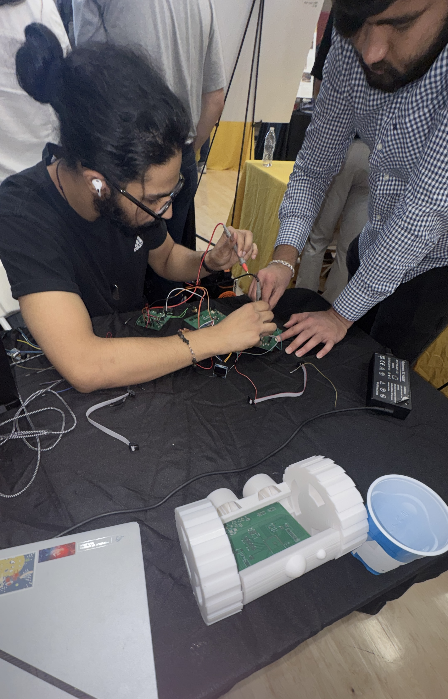

# Showcase and Prototype

This page documents the R6 Recon Amphibot as presented at the EGR314 Spring 2026 Innovation Showcase at Arizona State University. It includes the team poster, final project photos, and a video walkthrough of the system.

## Innovation Showcase Poster

**Figure 01:** R6 Recon Amphibot Innovation Showcase Poster - Mihir Patel, Raunak Singh, Lakshanand Sugumar. EGR314 Spring 2026.

[Download Poster PDF](poster-egr314.pdf)

## Final Project Photos

**Figure 02:** R6 Recon Amphibot with 3D printed chassis at the Innovation Showcase, showing PCB layout inside the open body.

**Figure 03:** Team XPED working on the system during the Innovation Showcase. The 3D printed chassis and voting container provided by the ASU Innovation Showcase are visible on the table.

## Project Demo Video

The following video walks through the R6 Recon Amphibot project, covering the system architecture, subsystem functionality, and how the UART daisy-chain, MQTT communication, and sensor telemetry work together. 

<iframe width="560" height="315"
src="https://www.youtube.com/embed/wF2qDuwnyOg"
title="EGR314 Team 302 R6 Recon Amphibot Demo"
frameborder="0"
allowfullscreen></iframe>

## What Was Demonstrated

At the Innovation Showcase the team demonstrated the following:

Two-way MQTT communication between thep ESP32 wireless gateway and the web dashboard, with live telemetry updates visible on screen. Structured 64-byte UART packet routing across all three boards in the daisy chain. Real-time sensor readings including IMU tilt, temperature, and humidity displayed on the OLED screen and published to the MQTT broker. Motor control via remote commands sent from the web interface. The WiFi-loss emergency stop failsafe triggering an automatic motor shutdown when the broker connection dropped. A half-open 3D printed chassis was used to show visitors how the PCBs are arranged inside the robot body and how the wheels connect to the electronics.