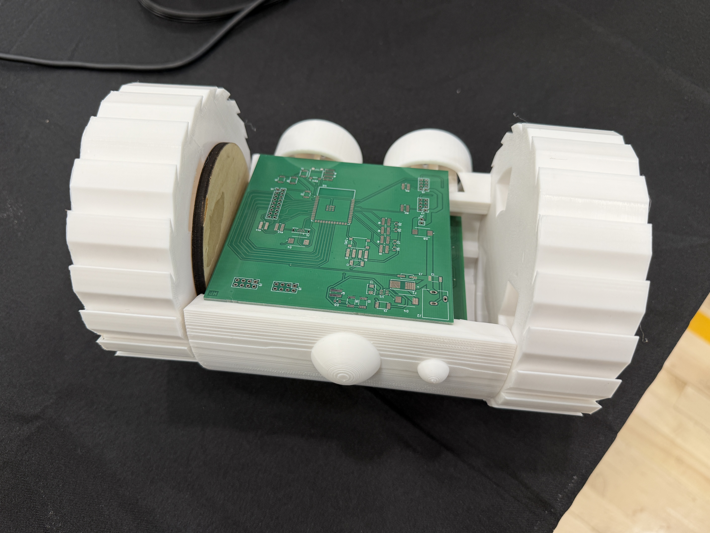

Team XPED 
Team 302 
**Submission: May 04, 2026** 
Spring - 2026 
Arizona State University 
**EGR 314** 
Professor Kevin Nichols 

## Welcome 
> Welcome to the official **R6 Recon Amphibot Project Report Website** for EGR 314.
> This site documents Team XPED's modular UART-daisy-chained amphibious scout,
> from initial concept through the final Innovation Showcase demonstration.

## Team Introduction

Team XPED (302) is a three-person engineering team from Arizona State University
working in EGR314 Spring 2026. We designed and built the R6 Recon Amphibot, a
modular amphibious exploration robot with a UART daisy-chain architecture connecting
three custom PCBs. Our work emphasized standards-based communication, real-time
sensor telemetry, wireless MQTT control, and a 3D printed chassis designed for
the Innovation Showcase.

## Project Summary

The R6 Recon Amphibot is a three-PCB modular exploration robot designed to scout
hazardous environments and relay real-time sensor data and motor telemetry to a
remote operator over Wi-Fi using MQTT. The system uses a UART daisy-chain
connecting the ESP32 wireless gateway, the sensor and HMI board, and the actuator
board. At the Innovation Showcase, the team demonstrated live two-way MQTT
communication, structured UART packet routing between all three boards, real-time
sensor readings including IMU tilt, temperature, and humidity, and motor control
via remote commands. A half-open 3D printed chassis was used to show visitors
exactly how the PCBs are arranged inside the robot body and how the wheels and
drivetrain connect to the electronics.

## Final Project Photo

**Figure 01:** R6 Recon Amphibot with 3D printed chassis at the Innovation Showcase,
showing PCB layout inside the open body.

**Figure 02:** Team XPED working on the system during the Innovation Showcase.
The 3D printed chassis and water container used for the amphibious demo are
visible on the table.

## Team Members Datasheet Links

| **Team Member** | **Individual Datasheet** |
| --- | --- |
| Mihir Patel | [Mihir-Patel-64.github.io](https://mihir-patel-64.github.io/) |
| Lakshanand Sugumar | [lakshanandsugumar.github.io](https://lakshanandsugumar.github.io) |
| Raunak Singh | [ronnie772.github.io](https://ronnie772.github.io/Ronnie772Datasheet/) |

## Project Sections

You can navigate to the main sections of our report using the top menu or the
links below:

- **[Team Organization](01-Organization/Team-Organization.md)** – Charter, mission, roles, and communication protocols
- **[Concept Design](02-Concept-Design/Design.md)** – Ideation process, R6 amphibot selection, key features
- **[Project Requirements](03-Project-Requirements/Project-Requirements.md)** – UART specs, serial peripherals, performance targets
- **[Team Block Diagram](04-Block-Diagram-Process-Diagram-and-Message-Structure/Team-Block-Diagram/Team-Block-Diagram.md)** – 3-PCB daisy chain, data flow, interfaces
- **[Team Process Diagram](04-Block-Diagram-Process-Diagram-and-Message-Structure/Communication-Process-Diagram/Communication-Process-Diagram.md)** – Sequence diagram, message flow, user interactions
- **[Message Types](04-Block-Diagram-Process-Diagram-and-Message-Structure/Message-Structure/Message-Structure.md)** – 64-byte packet format, byte-level definitions
- **[Showcase and Prototype](05-Showcase-Demostration/Showcase.md)** – Innovation Showcase poster, final system photos, and demo video
- **[Project Version 2.0](06-Project-Version-2.0/Project_version_2.0.md)** – Future improvements, hardware upgrades, and protocol enhancements